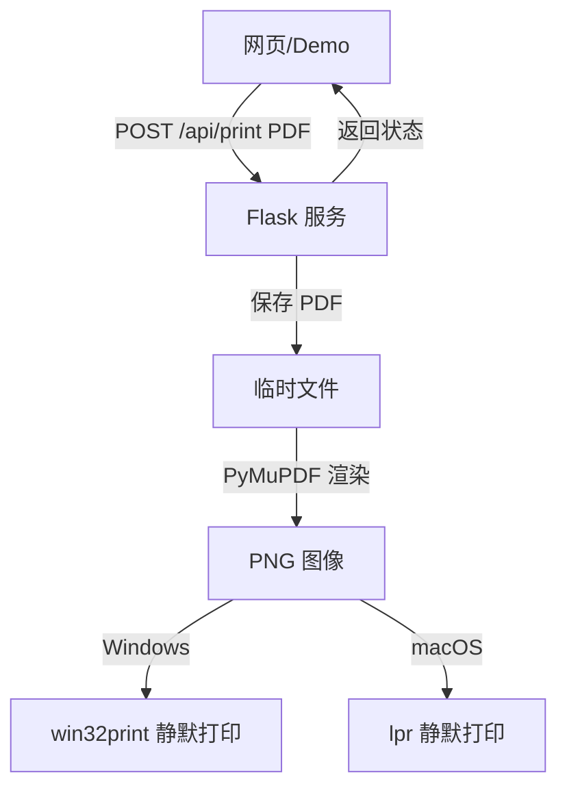

## 产品概述

一个基于 Python 的本地打印服务工具，允许网页通过 HTTP 接口上传 PDF 文件，由本地服务自动调用系统默认打印机进行静默打印。

## 核心功能

- 启动本地 HTTP 服务，监听 PDF 打印请求
- 接收 `multipart/form-data` 上传的 PDF 文件
- 将 PDF 转换为可打印图像，调用系统默认打印机静默打印
- 返回打印任务 ID 和打印结果
- 提供 `/demo` 前端调用示例页面，展示文件上传与打印触发流程
- 支持 Windows 单文件 `.exe` 与 macOS `.app` 双击运行打包
- 后台托盘驻留，支持退出/重启服务

## 技术边界

- 仅打印 PDF 格式
- 使用系统默认打印机，不弹系统打印对话框
- 运行环境为 Windows 10+ 和 macOS 12+

## 技术栈

- 后端框架：Python 3.11 + Flask
- PDF 渲染：PyMuPDF (fitz)
- 图像处理：Pillow
- 跨平台打印：
- Windows：`pywin32` + `win32print` 打印位图
- macOS：CUPS `lpr` 命令
- 系统托盘：pystray
- 打包工具：PyInstaller
- 前端 Demo：原生 HTML + CSS + JavaScript

## 实现方案

1. Flask 暴露本地 HTTP 服务，端口默认 `5000`，绑定 `127.0.0.1`。
2. `/api/print` 接收 PDF 上传，保存为临时文件，使用 PyMuPDF 将 PDF 每一页渲染为 PNG。
3. 打印模块根据平台差异：

- Windows：使用 `win32print` 创建打印设备上下文，将每页 PNG 绘制到打印机 DC 上完成静默打印。
- macOS：将 PNG 临时文件通过 `lpr` 命令提交到默认打印机。

4. 打印结果通过 JSON 返回给前端，打印任务写入内存任务列表。
5. `/demo` 返回静态 HTML，展示文件上传、提交打印、轮询状态。
6. 使用 PyInstaller 打包：

- Windows：`--onefile --windowed` 生成 `auto-printer.exe`
- macOS：`--windowed` 生成 `AutoPrinter.app`

7. 启动时隐藏控制台窗口，通过系统托盘图标控制退出。

## 架构设计



## 目录结构

```
auto-printer/
├── src/
│   ├── main.py              # [NEW] 入口：启动托盘、Flask 服务、配置管理
│   ├── app.py               # [NEW] Flask 路由：/api/print、/api/status、/demo
│   ├── printer.py           # [NEW] 跨平台静默打印逻辑（PDF 转图 + 打印）
│   ├── config.py            # [NEW] 端口、日志、临时目录等配置
│   ├── tasks.py             # [NEW] 内存级打印任务记录
│   ├── tray.py              # [NEW] 系统托盘图标与菜单
│   ├── templates/
│   │   └── demo.html        # [NEW] 前端调用示例页面
│   └── static/
│       ├── style.css        # [NEW] Demo 页面样式
│       └── app.js           # [NEW] Demo 页面交互逻辑
├── scripts/
│   ├── build_win.ps1        # [NEW] Windows PyInstaller 构建脚本
│   └── build_mac.sh         # [NEW] macOS PyInstaller 构建脚本
├── dist/                    # [NEW] 打包输出目录
├── requirements.txt         # [NEW] Python 依赖
├── auto-printer.spec        # [NEW] PyInstaller 规格文件
├── .gitignore               # [NEW] 忽略文件
└── README.md                # [NEW] 使用说明与打包步骤
```

## 关键代码结构

### 打印接口

```python
def print_pdf(file_path: str) -> PrintResult:
    """
    将 PDF 文件静默打印到系统默认打印机。
    平台实现分别调用 Windows / macOS 原生接口。
    """
```

### Flask 路由

```python
@bp.route('/api/print', methods=['POST'])
def handle_print():
    """
    接收 multipart/form-data 上传的 PDF 文件。
    返回：{job_id, status, message}
    """
```

### 任务状态

```python
class PrintTask:
    id: str
    status: Literal['pending', 'printing', 'done', 'failed']
    created_at: str
    message: Optional[str]
```

## 性能与可靠性

- 临时文件使用 `tempfile` 模块，打印完成后清理，避免磁盘堆积。
- 大 PDF 分页串行渲染，每页独立处理，避免一次性内存过高。
- 打印操作放入后台线程，避免阻塞 HTTP 请求响应。
- 使用内存级任务列表，最多保留最近 100 条任务记录。
- 添加全局异常捕获，打印失败返回明确错误信息。

## 安全考虑

- 服务只绑定 `127.0.0.1`，避免局域网暴露。
- 对上传文件进行大小限制（默认 50MB）和 MIME 类型校验（`application/pdf`）。
- 临时文件保存到系统临时目录，设置合理权限。
- 不记录文件内容，仅记录文件名和任务状态。

## 设计概述

采用现代简洁的 Web 上传界面，适合作为工具调用 Demo。页面居中的卡片布局，包含标题、文件选择区、上传/打印按钮、状态反馈。使用柔和渐变色背景、圆角、阴影和微动效，提升视觉质感。

## 页面结构

- 顶部标题：工具名称 + 简短说明
- 文件上传区：拖拽/点击选择 PDF，显示文件名和大小
- 操作按钮：打印按钮 + 清空按钮
- 状态面板：展示打印进度、成功/失败提示、任务 ID

## 交互设计

- 文件选择后显示文件名和大小
- 点击打印后按钮进入加载状态，禁用重复提交
- 打印完成后显示成功或错误提示
- 支持拖拽上传，拖拽区域有边框高亮反馈
- 按钮和卡片有悬停阴影与缩放动效

## 响应式布局

- 桌面端：居中卡片，最大宽度 480px
- 移动端：卡片宽度 100%，边距自适应